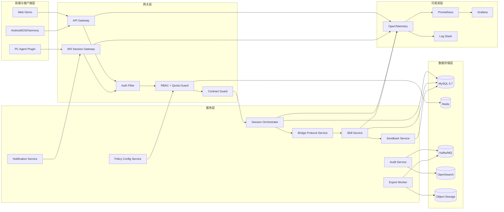

# OpenCode Skill Bridge 项目级系统架构设计文档

## 1. 架构目标

本架构面向“整个项目”而非单一里程碑，目标是同时满足：

1. 技术可行性：在现有技术栈上可落地、可迭代、可运维。
2. 扩展性：支持从 v1.0（闭环验证）演进到多端、治理、审计、生产硬化。
3. 稳定性：在高并发触发、长连接会话、回传链路下保证一致性与可恢复性。
4. 可治理性：权限、配额、审计、发布门禁形成闭环。

## 2. 技术栈选型（全项目）

### 2.1 选型总览

| 层级 | 推荐技术 | 选型理由 |
|---|---|---|
| 客户端层 | TypeScript（PC Plugin/Web）、Android/iOS/Harmony SDK | 与现有插件和 Web 代码一致，便于多端对齐与协议复用 |
| API 与服务层 | Java 21 + Spring Boot 3.4.x（Gateway/Skill Service） | 团队已有沉淀，生态成熟，便于治理与运维 |
| 内部高性能 RPC | gRPC（服务间可选） | 对低延迟、强类型、双向流场景友好 |
| 对外接口风格 | RESTful + WebSocket（流式会话） | 兼容前端与插件接入习惯，实时性可保障 |
| SQL 数据库 | MySQL 5.7 | 已有生产基线，适合事务与关系数据 |
| NoSQL/缓存 | Redis | 配额计数、会话短状态、幂等键、热点缓存 |
| 消息中间件 | Kafka（或现网 MQ） | 解耦主链路与异步任务（审计、导出、通知） |
| 搜索分析（审计） | OpenSearch/Elasticsearch（建议） | 支持多维过滤与审计检索 |
| 对象存储 | S3/MinIO（建议） | 审计导出文件持久化与下载 |
| 可观测性 | Prometheus + Grafana + OpenTelemetry + ELK | 指标、日志、追踪统一，便于跨服务排障 |
| CI/CD 门禁 | GitHub Actions + `verify:phase-07` | 保证兼容性与发布质量可执行 |

### 2.2 为什么是“SQL + NoSQL”双存储

- MySQL：负责强一致业务数据（会话、回传、策略版本、审计主记录）。
- Redis：负责高并发短状态（令牌桶、会话游标、幂等键、热点配置缓存）。
- OpenSearch：负责高维审计查询与运营检索（非事务主存储）。

## 3. 逻辑架构图（Mermaid）



## 4. 分层职责与协作

### 4.1 前端与客户端层

- 提供 Slash 触发、会话展示、回传交互。
- 通过 REST + WebSocket 接入网关。
- 承担轻状态管理，重状态以服务端为准。

### 4.2 网关层

- 统一入口、鉴权、权限、配额、契约校验、路由。
- 负责请求级 `trace_id` 注入和上下文传播。
- 负责同步返回与流式转发。

### 4.3 服务层

- Session Orchestrator：会话生命周期编排、重连恢复决策。
- Bridge Service：OpenCode 协议与内部协议转换。
- Skill Service：会话持久化、历史查询。
- Sendback Service：回传 IM 与幂等控制。
- Policy Config Service：策略版本管理与分发。
- Audit Service/Export Worker：审计查询与导出任务。

### 4.4 数据层

- MySQL：事务数据源（会话、回传、策略、审计主记录）。
- Redis：热点缓存与治理控制平面（RBAC/Quota/Idempotency）。
- Kafka/MQ：异步解耦（审计写入、导出、通知）。
- OpenSearch：审计检索。
- Object Storage：导出文件存储。

## 5. 核心组件设计（关键技术挑战）

### 5.1 挑战一：高并发触发与治理决策

问题：

- 高峰时大量 Slash 请求并发进入，若策略校验走 DB 会造成瓶颈。

方案：

1. 网关侧引入本地缓存 + Redis 缓存的双层策略缓存。
2. 配额采用 Redis 原子计数 + Lua 脚本实现窗口限流。
3. 策略变更通过 MQ 广播失效事件，网关秒级刷新。

效果：

- 降低 DB 压力，保证高并发下网关判定稳定。

### 5.2 挑战二：长连接会话与实时通知

问题：

- 会话增量事件需要低延迟推送且支持断线恢复。

方案：

1. WebSocket 会话网关维护连接与心跳。
2. Session Orchestrator 维护 resume anchor（seq/offset）。
3. 断线重连后按 anchor 补发，避免重复和乱序。

效果：

- 保证实时性与连续性，提升用户感知质量。

### 5.3 挑战三：回传 IM 的一致性与幂等

问题：

- 网络抖动和重试可能导致重复发送。

方案：

1. 业务幂等键：`tenant_id + session_id + turn_id + content_hash`。
2. 先写库再发送（Outbox 思路），失败可重放。
3. 发送结果回写状态机（pending/sent/failed）。

效果：

- 避免重复消息，保证最终一致。

### 5.4 挑战四：审计大数据存储与检索

问题：

- 审计数据量持续增长，主库不适合复杂检索和导出。

方案：

1. 审计主记录落 MySQL，异步同步到 OpenSearch。
2. 查询走 OpenSearch，导出走异步任务 + 对象存储。
3. 设置生命周期策略（冷热分层与归档）。

效果：

- 主链路不受影响，审计查询和导出可扩展。

### 5.5 挑战五：契约演进与发布风险控制

问题：

- 跨组件契约变更容易引入破坏性回归。

方案：

1. 关键事件强制 `contract_version`。
2. 兼容策略：只增不破，废弃字段两版本窗口。
3. 发布前统一执行 Hard Gate，豁免必须审批+到期。

效果：

- 降低跨版本故障概率，提升发布可控性。

## 6. 数据流向（关键链路）

### 6.1 触发链路

客户端 -> Gateway -> Auth/RBAC/Quota -> Session Orchestrator -> Bridge -> Skill Service -> 客户端回执

### 6.2 会话链路

Skill Service 增量事件 -> Session Gateway -> 客户端  
同时：事件与状态写 MySQL，指标日志写观测系统

### 6.3 回传链路

客户端提交回传 -> Gateway 二次治理 -> Sendback Service -> IM API  
同时：结果写 MySQL + 审计事件异步入 OpenSearch

## 7. 接口定义规范

## 7.1 API 风格

- 对外：RESTful（业务接口） + WebSocket（实时会话流）。
- 对内：优先 REST；高吞吐/低时延链路可引入 gRPC。
- 异步：事件驱动（Kafka/MQ）用于审计、导出、通知。

### 7.2 REST 设计约定

- URL 版本化：`/api/v1/...`
- 资源命名：名词复数，如 `/sessions`、`/sendbacks`、`/policies`
- 动作语义：通过 HTTP Method 表达（GET/POST/PUT/DELETE）
- 幂等要求：
  - 查询接口天然幂等
  - 写接口通过 `Idempotency-Key` 头保障幂等

### 7.3 公共返回体结构

```json
{
  "code": "0",
  "message": "OK",
  "request_id": "req-20260304-xxxx",
  "trace_id": "trace-20260304-xxxx",
  "timestamp": "2026-03-04T09:00:00Z",
  "data": {},
  "error": null
}
```

错误返回示例：

```json
{
  "code": "AUTH_INVALID_CREDENTIAL",
  "message": "AK/SK invalid",
  "request_id": "req-20260304-xxxx",
  "trace_id": "trace-20260304-xxxx",
  "timestamp": "2026-03-04T09:00:00Z",
  "data": null,
  "error": {
    "failure_class": "auth",
    "retryable": false,
    "next_action": "check_credentials"
  }
}
```

### 7.4 事件 Envelope 规范（流式/异步）

```json
{
  "event_type": "skill.turn.delta",
  "contract_version": "1.0",
  "tenant_id": "t1",
  "session_id": "s1",
  "trace_id": "trace-xxx",
  "seq": 1024,
  "occurred_at": "2026-03-04T09:00:00Z",
  "payload": {}
}
```

### 7.5 错误码分层建议

- `AUTH_*`：鉴权相关
- `AUTHZ_*`：权限相关
- `QUOTA_*`：配额与限流
- `SESSION_*`：会话管理
- `SEND_*`：回传发送
- `COMPAT_*`：契约兼容
- `SYS_*`：系统内部错误

## 8. 可扩展性设计

1. 水平扩展：Gateway、Session Gateway、Skill Service 均无状态化部署。
2. 配置扩展：策略中心支持租户粒度、角色粒度、能力粒度扩展。
3. 存储扩展：审计检索与业务事务分离，避免单库瓶颈。
4. 接口扩展：版本化 + 可选字段策略，保证兼容演进。
5. 端能力扩展：新客户端接入只需实现统一 SDK 契约。

## 9. 技术可行性结论

- 与现有项目技术栈一致，迁移成本低。
- 关键挑战均有成熟工程方案（缓存限流、幂等、Outbox、异步导出、契约门禁）。
- 架构支持“先闭环再扩展”的演进路径，适合持续迭代。
- 对未来多端和治理能力具备良好扩展边界。

## 10. 服务级 API 清单（可直接落地）

### 10.1 对外 API（RESTful）

| API | Method | 说明 | 鉴权 | 幂等要求 | 关键错误码 |
|---|---|---|---|---|---|
| `/api/v1/skills/sessions` | POST | 创建技能会话并返回会话ID与初始状态 | AK/SK + Token | 建议支持 `Idempotency-Key` | `AUTH_*`, `AUTHZ_*`, `QUOTA_*`, `SESSION_CREATE_FAILED` |
| `/api/v1/skills/sessions/{session_id}` | GET | 查询会话状态与摘要 | AK/SK + Token | 天然幂等 | `SESSION_NOT_FOUND`, `AUTH_*` |
| `/api/v1/skills/sessions/{session_id}/history` | GET | 查询会话历史（分页） | AK/SK + Token | 天然幂等 | `INVALID_CURSOR`, `SESSION_NOT_FOUND` |
| `/api/v1/skills/sendbacks` | POST | 提交回传IM请求 | AK/SK + Token | 必须传 `Idempotency-Key` | `SEND_INVALID_SEGMENT`, `SEND_IM_FAILED`, `QUOTA_*` |
| `/api/v1/skills/sendbacks/{request_id}` | GET | 查询回传状态 | AK/SK + Token | 天然幂等 | `SEND_NOT_FOUND` |
| `/api/v1/policies/rbac` | GET | 查询租户RBAC策略 | 管理员Token | 天然幂等 | `AUTHZ_DENIED` |
| `/api/v1/policies/rbac/{policy_id}` | PUT | 更新RBAC策略 | 管理员Token | 幂等更新（按版本） | `POLICY_VERSION_CONFLICT` |
| `/api/v1/policies/quota` | GET | 查询租户配额策略 | 管理员Token | 天然幂等 | `AUTHZ_DENIED` |
| `/api/v1/policies/quota/{policy_id}` | PUT | 更新配额策略 | 管理员Token | 幂等更新（按版本） | `POLICY_VERSION_CONFLICT` |
| `/api/v1/policies/releases` | POST | 发布策略版本 | 管理员Token | 幂等（同版本重复发布） | `POLICY_RELEASE_FAILED` |
| `/api/v1/policies/releases/{release_id}/rollback` | POST | 回滚策略版本 | 管理员Token | 幂等（同目标版本） | `POLICY_ROLLBACK_FAILED` |
| `/api/v1/audit/events` | GET | 审计事件检索 | 运营/审计Token | 天然幂等 | `AUDIT_QUERY_TIMEOUT` |
| `/api/v1/audit/exports` | POST | 创建审计导出任务 | 运营/审计Token | 幂等（按导出条件hash） | `AUDIT_EXPORT_CREATE_FAILED` |
| `/api/v1/audit/exports/{job_id}` | GET | 查询导出任务状态 | 运营/审计Token | 天然幂等 | `AUDIT_EXPORT_NOT_FOUND` |

### 10.2 WebSocket 会话流接口

- 连接路径：`/ws/v1/skills/sessions/{session_id}`
- Header：
  - `Authorization: Bearer <token>`
  - `X-Trace-Id: <trace_id>`
- 关键事件类型：
  - `skill.session.accepted`
  - `skill.turn.delta`
  - `skill.turn.final`
  - `skill.session.completed`
  - `runtime.failed`
- 事件公共字段：
  - `contract_version`
  - `tenant_id`
  - `session_id`
  - `trace_id`
  - `seq`
  - `occurred_at`

### 10.3 内部服务接口规范（REST/gRPC）

| 调用方 -> 被调方 | 协议 | 接口 | 说明 |
|---|---|---|---|
| Gateway -> Session Orchestrator | REST | `POST /internal/v1/sessions/dispatch` | 会话编排入口 |
| Session Orchestrator -> Bridge Service | gRPC(可选) | `BridgeStream.Process` | 协议转换与流转发 |
| Bridge Service -> Skill Service | REST | `POST /internal/v1/skill-events` | 会话事件持久化 |
| Sendback Service -> IM API | REST | `POST /internal/v1/im/messages` | 回传消息发送 |
| Gateway -> Policy Service | REST | `GET /internal/v1/policies/effective` | 获取生效策略快照 |
| Audit Service -> OpenSearch | HTTP | `_bulk`, `_search` | 审计索引写入与查询 |

### 10.4 API 参数与风格硬约束

1. 所有写接口必须支持 `request_id` 或 `Idempotency-Key`。
2. 所有返回体必须包含 `code/message/request_id/trace_id/timestamp`。
3. 列表接口统一支持 `page_no/page_size/sort_by/order_by`。
4. 全部时间字段使用 UTC ISO-8601。
5. 破坏性字段变更必须升级 API 主版本。

## 11. MySQL DDL 草案（MySQL 5.7）

> 说明：以下为项目级核心表草案，满足当前与后续里程碑需求。字符集统一 `utf8mb4`，引擎统一 `InnoDB`。

### 11.1 会话主表

```sql
CREATE TABLE `skill_session` (
  `id` BIGINT NOT NULL AUTO_INCREMENT,
  `session_id` VARCHAR(64) NOT NULL,
  `tenant_id` VARCHAR(64) NOT NULL,
  `user_id` VARCHAR(64) NOT NULL,
  `client_type` VARCHAR(32) NOT NULL,
  `status` VARCHAR(32) NOT NULL,
  `last_seq` BIGINT NOT NULL DEFAULT 0,
  `trace_id` VARCHAR(64) NOT NULL,
  `created_at` DATETIME NOT NULL,
  `updated_at` DATETIME NOT NULL,
  PRIMARY KEY (`id`),
  UNIQUE KEY `uk_session_id` (`session_id`),
  KEY `idx_tenant_user_created` (`tenant_id`, `user_id`, `created_at`),
  KEY `idx_status_updated` (`status`, `updated_at`)
) ENGINE=InnoDB DEFAULT CHARSET=utf8mb4;
```

### 11.2 会话事件表

```sql
CREATE TABLE `skill_session_event` (
  `id` BIGINT NOT NULL AUTO_INCREMENT,
  `session_id` VARCHAR(64) NOT NULL,
  `turn_id` VARCHAR(64) NOT NULL,
  `seq` BIGINT NOT NULL,
  `event_type` VARCHAR(64) NOT NULL,
  `actor` VARCHAR(32) NOT NULL,
  `payload_json` MEDIUMTEXT NOT NULL,
  `trace_id` VARCHAR(64) NOT NULL,
  `created_at` DATETIME NOT NULL,
  PRIMARY KEY (`id`),
  UNIQUE KEY `uk_session_seq` (`session_id`, `seq`),
  KEY `idx_session_turn` (`session_id`, `turn_id`),
  KEY `idx_trace_created` (`trace_id`, `created_at`)
) ENGINE=InnoDB DEFAULT CHARSET=utf8mb4;
```

### 11.3 回传请求表

```sql
CREATE TABLE `sendback_request` (
  `id` BIGINT NOT NULL AUTO_INCREMENT,
  `request_id` VARCHAR(64) NOT NULL,
  `idempotency_key` VARCHAR(128) NOT NULL,
  `tenant_id` VARCHAR(64) NOT NULL,
  `session_id` VARCHAR(64) NOT NULL,
  `turn_id` VARCHAR(64) NOT NULL,
  `status` VARCHAR(32) NOT NULL,
  `im_message_id` VARCHAR(64) DEFAULT NULL,
  `error_code` VARCHAR(64) DEFAULT NULL,
  `trace_id` VARCHAR(64) NOT NULL,
  `created_at` DATETIME NOT NULL,
  `updated_at` DATETIME NOT NULL,
  PRIMARY KEY (`id`),
  UNIQUE KEY `uk_request_id` (`request_id`),
  UNIQUE KEY `uk_idempotency_key` (`idempotency_key`),
  KEY `idx_tenant_session_created` (`tenant_id`, `session_id`, `created_at`)
) ENGINE=InnoDB DEFAULT CHARSET=utf8mb4;
```

### 11.4 RBAC 策略表

```sql
CREATE TABLE `tenant_rbac_policy` (
  `id` BIGINT NOT NULL AUTO_INCREMENT,
  `policy_id` VARCHAR(64) NOT NULL,
  `tenant_id` VARCHAR(64) NOT NULL,
  `role_id` VARCHAR(64) NOT NULL,
  `capability` VARCHAR(64) NOT NULL,
  `effect` VARCHAR(16) NOT NULL,
  `version_no` BIGINT NOT NULL,
  `status` VARCHAR(16) NOT NULL,
  `updated_by` VARCHAR(64) NOT NULL,
  `updated_at` DATETIME NOT NULL,
  PRIMARY KEY (`id`),
  UNIQUE KEY `uk_policy_id` (`policy_id`),
  KEY `idx_tenant_role_cap` (`tenant_id`, `role_id`, `capability`),
  KEY `idx_tenant_version` (`tenant_id`, `version_no`)
) ENGINE=InnoDB DEFAULT CHARSET=utf8mb4;
```

### 11.5 配额策略表

```sql
CREATE TABLE `tenant_quota_policy` (
  `id` BIGINT NOT NULL AUTO_INCREMENT,
  `policy_id` VARCHAR(64) NOT NULL,
  `tenant_id` VARCHAR(64) NOT NULL,
  `window_type` VARCHAR(16) NOT NULL,
  `quota_limit` INT NOT NULL,
  `burst_limit` INT NOT NULL,
  `version_no` BIGINT NOT NULL,
  `status` VARCHAR(16) NOT NULL,
  `updated_by` VARCHAR(64) NOT NULL,
  `updated_at` DATETIME NOT NULL,
  PRIMARY KEY (`id`),
  UNIQUE KEY `uk_quota_policy_id` (`policy_id`),
  KEY `idx_tenant_window` (`tenant_id`, `window_type`),
  KEY `idx_tenant_version` (`tenant_id`, `version_no`)
) ENGINE=InnoDB DEFAULT CHARSET=utf8mb4;
```

### 11.6 策略发布记录表

```sql
CREATE TABLE `tenant_policy_release` (
  `id` BIGINT NOT NULL AUTO_INCREMENT,
  `release_id` VARCHAR(64) NOT NULL,
  `tenant_id` VARCHAR(64) NOT NULL,
  `target_version` BIGINT NOT NULL,
  `release_type` VARCHAR(32) NOT NULL,
  `status` VARCHAR(16) NOT NULL,
  `checksum` VARCHAR(128) NOT NULL,
  `created_by` VARCHAR(64) NOT NULL,
  `created_at` DATETIME NOT NULL,
  `finished_at` DATETIME DEFAULT NULL,
  PRIMARY KEY (`id`),
  UNIQUE KEY `uk_release_id` (`release_id`),
  KEY `idx_tenant_target_version` (`tenant_id`, `target_version`)
) ENGINE=InnoDB DEFAULT CHARSET=utf8mb4;
```

### 11.7 审计事件表

```sql
CREATE TABLE `audit_event` (
  `id` BIGINT NOT NULL AUTO_INCREMENT,
  `event_id` VARCHAR(64) NOT NULL,
  `tenant_id` VARCHAR(64) NOT NULL,
  `actor_id` VARCHAR(64) NOT NULL,
  `action` VARCHAR(64) NOT NULL,
  `result` VARCHAR(16) NOT NULL,
  `resource_type` VARCHAR(64) NOT NULL,
  `resource_id` VARCHAR(64) NOT NULL,
  `trace_id` VARCHAR(64) NOT NULL,
  `detail_json` MEDIUMTEXT NOT NULL,
  `created_at` DATETIME NOT NULL,
  PRIMARY KEY (`id`),
  UNIQUE KEY `uk_event_id` (`event_id`),
  KEY `idx_tenant_action_created` (`tenant_id`, `action`, `created_at`),
  KEY `idx_trace_created` (`trace_id`, `created_at`)
) ENGINE=InnoDB DEFAULT CHARSET=utf8mb4;
```

### 11.8 导出任务表

```sql
CREATE TABLE `audit_export_job` (
  `id` BIGINT NOT NULL AUTO_INCREMENT,
  `job_id` VARCHAR(64) NOT NULL,
  `tenant_id` VARCHAR(64) NOT NULL,
  `request_hash` VARCHAR(128) NOT NULL,
  `status` VARCHAR(16) NOT NULL,
  `file_uri` VARCHAR(512) DEFAULT NULL,
  `error_code` VARCHAR(64) DEFAULT NULL,
  `trace_id` VARCHAR(64) NOT NULL,
  `created_by` VARCHAR(64) NOT NULL,
  `created_at` DATETIME NOT NULL,
  `updated_at` DATETIME NOT NULL,
  PRIMARY KEY (`id`),
  UNIQUE KEY `uk_job_id` (`job_id`),
  KEY `idx_tenant_status_created` (`tenant_id`, `status`, `created_at`),
  KEY `idx_request_hash` (`request_hash`)
) ENGINE=InnoDB DEFAULT CHARSET=utf8mb4;
```

## 12. 容量评估与扩容阈值

### 12.1 评估基线假设（可按实际替换）

| 维度 | 基线值 |
|---|---|
| 注册租户数 | 2,000 |
| 日活用户（DAU） | 200,000 |
| 峰值在线会话用户 | 30,000 |
| 峰值触发请求QPS | 1,200 |
| 峰值会话事件写入QPS | 8,000 |
| 峰值回传请求QPS | 300 |
| 审计事件写入QPS | 3,000 |

### 12.2 核心容量估算

1. 会话事件日写入量：
   - `8,000 qps * 3,600 * 4h峰值折算系数0.35 ≈ 40M/day`
2. 审计事件日写入量：
   - `3,000 qps * 86,400 * 0.12 ≈ 31M/day`
3. 回传请求日规模：
   - `300 qps * 86,400 * 0.08 ≈ 2M/day`

> 建议：MySQL 主库仅保存事务主数据；审计明细和检索迁移至 OpenSearch，按天索引并设置生命周期策略。

### 12.3 资源建议（初始生产）

| 组件 | 建议实例 | 说明 |
|---|---|---|
| API Gateway | 4-6 实例 | 无状态水平扩展，CPU优先 |
| WS Session Gateway | 4-6 实例 | 按连接数与带宽扩容 |
| Skill Service | 4 实例 | 按事件写入和查询压力扩容 |
| Sendback Service | 2-3 实例 | 外部IM依赖，需重试队列 |
| Policy Service | 2 实例 | 读多写少，配置缓存优先 |
| Audit Service | 3 实例 | 写入与查询分离部署 |
| Export Worker | 2 实例 | 可按任务堆积动态扩容 |
| Redis | 主从+哨兵/集群 | 限流与幂等高可用 |
| MySQL | 主从 + 只读副本 | 读写分离，保证事务一致 |
| Kafka/MQ | 3 Broker 起步 | 审计/导出异步吞吐保障 |

### 12.4 扩容阈值与触发策略

| 指标 | 阈值 | 动作 |
|---|---|---|
| Gateway CPU | 连续10分钟 > 70% | 扩容 1-2 实例 |
| WS 连接数 | 单实例 > 15,000 | 水平扩容并迁移连接 |
| Redis 命中率 | < 95% | 增加内存或优化键设计 |
| MySQL 主库写延迟 | > 50ms | 分表/拆库或提升实例规格 |
| MQ 消费堆积 | > 5 分钟 | 扩消费者实例并排查慢消费 |
| 导出任务排队时长 | > 10 分钟 | 扩容 Export Worker |

### 12.5 SLO 与可用性预算

- 目标可用性：99.9%
- 月故障预算：约 43 分钟
- 关键链路 SLO：
  - 会话创建成功率 >= 99.95%
  - 回传成功率（非上游IM故障）>= 99.9%
  - 审计查询成功率 >= 99.5%

### 12.6 压测与演练建议

1. 每次大版本前执行三类压测：触发峰值压测、会话流压测、导出任务压测。
2. 每月至少一次故障演练：Redis 抖动、MQ 堆积、IM 下游超时。
3. 将压测结果纳入发布门禁，达不到阈值不允许发布。
