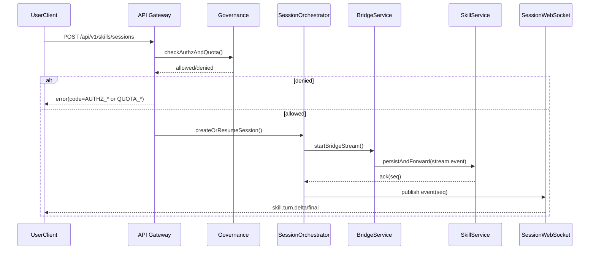
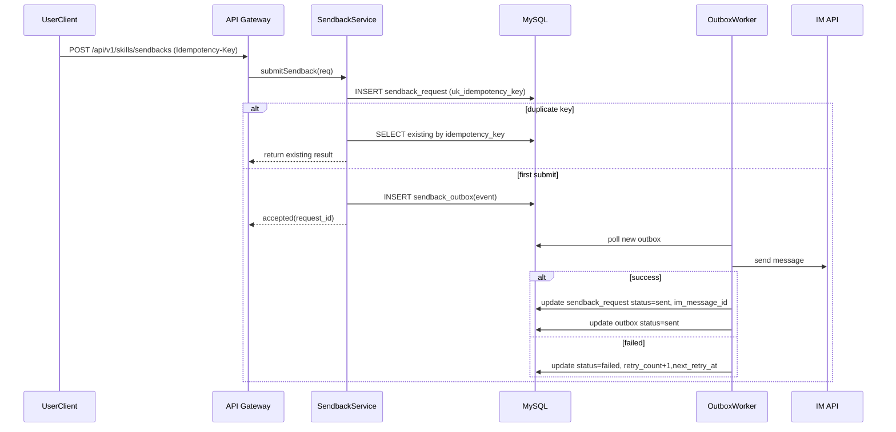
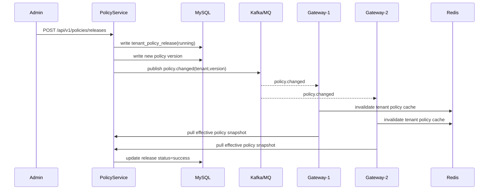

# 1. 文档目标与范围

本文档面向研发直接落地，覆盖完整项目核心模块：

1. 网关接入与治理（鉴权、RBAC、配额）
2. 会话编排与流式桥接（长连接、断线恢复、序列一致）
3. Skill 持久化与历史查询
4. 回传 IM（幂等、Outbox、重试）
5. 策略配置发布与回滚
6. 审计查询与导出
7. 发布治理（兼容校验、门禁、豁免）

输出粒度要求：字段级 DDL、类定义、时序、伪代码、缓存 Key 规则、性能优化建议。

# 2. 模块划分与代码组织建议

## 2.1 服务边界

- `gateway`：统一入口、鉴权、权限、配额、会话入口、WebSocket。
- `skill-service`：会话事件持久化、历史查询、回传编排。
- `policy-service`：RBAC/Quota 策略管理、版本发布、灰度与回滚。
- `audit-service`：审计事件查询、导出任务管理。
- `export-worker`：异步导出执行器。

## 2.2 包结构建议（Java）

```text
com.chatcui.gateway
  ├─ api
  ├─ auth
  ├─ governance
  ├─ session
  ├─ bridge
  ├─ ws
  ├─ metrics
  └─ common

com.chatcui.skill
  ├─ api
  ├─ persistence
  ├─ history
  ├─ sendback
  ├─ outbox
  └─ common

com.chatcui.policy
  ├─ api
  ├─ rbac
  ├─ quota
  ├─ release
  └─ cache

com.chatcui.audit
  ├─ api
  ├─ search
  ├─ export
  └─ common
```

# 3. 数据库模型（SQL DDL，字段级）

> 约束：
> 1. MySQL 5.7，`InnoDB + utf8mb4`  
> 2. 所有时间字段统一 UTC  
> 3. 业务幂等依赖唯一索引  
> 4. 大表建议按时间分表（由应用路由实现）

## 3.1 会话主表 `skill_session`

```sql
CREATE TABLE `skill_session` (
  `id` BIGINT NOT NULL AUTO_INCREMENT COMMENT '自增主键',
  `session_id` VARCHAR(64) NOT NULL COMMENT '业务会话ID',
  `tenant_id` VARCHAR(64) NOT NULL COMMENT '租户ID',
  `user_id` VARCHAR(64) NOT NULL COMMENT '用户ID',
  `client_type` VARCHAR(32) NOT NULL COMMENT '客户端类型: web/pc/android/ios/harmony',
  `status` VARCHAR(32) NOT NULL COMMENT '会话状态: pending/in_progress/completed/failed',
  `last_seq` BIGINT NOT NULL DEFAULT 0 COMMENT '最近处理的事件序号',
  `contract_version` VARCHAR(16) NOT NULL COMMENT '会话契约版本',
  `trace_id` VARCHAR(64) NOT NULL COMMENT '链路追踪ID',
  `created_at` DATETIME NOT NULL COMMENT '创建时间(UTC)',
  `updated_at` DATETIME NOT NULL COMMENT '更新时间(UTC)',
  PRIMARY KEY (`id`),
  UNIQUE KEY `uk_session_id` (`session_id`),
  KEY `idx_tenant_user_created` (`tenant_id`, `user_id`, `created_at`),
  KEY `idx_status_updated` (`status`, `updated_at`)
) ENGINE=InnoDB DEFAULT CHARSET=utf8mb4 COMMENT='技能会话主表';
```

## 3.2 会话事件表 `skill_session_event`

```sql
CREATE TABLE `skill_session_event` (
  `id` BIGINT NOT NULL AUTO_INCREMENT COMMENT '自增主键',
  `session_id` VARCHAR(64) NOT NULL COMMENT '会话ID',
  `turn_id` VARCHAR(64) NOT NULL COMMENT '轮次ID',
  `seq` BIGINT NOT NULL COMMENT '单会话递增序号',
  `event_type` VARCHAR(64) NOT NULL COMMENT '事件类型: turn.delta/turn.final/runtime.failed等',
  `actor` VARCHAR(32) NOT NULL COMMENT '角色: user/assistant/system',
  `payload_json` MEDIUMTEXT NOT NULL COMMENT '事件负载JSON',
  `trace_id` VARCHAR(64) NOT NULL COMMENT '追踪ID',
  `occurred_at` DATETIME NOT NULL COMMENT '事件发生时间(UTC)',
  `created_at` DATETIME NOT NULL COMMENT '入库时间(UTC)',
  PRIMARY KEY (`id`),
  UNIQUE KEY `uk_session_seq` (`session_id`, `seq`),
  KEY `idx_session_turn` (`session_id`, `turn_id`),
  KEY `idx_trace_created` (`trace_id`, `created_at`),
  KEY `idx_occurred_at` (`occurred_at`)
) ENGINE=InnoDB DEFAULT CHARSET=utf8mb4 COMMENT='会话事件流水表';
```

## 3.3 会话历史快照表 `skill_turn_snapshot`

```sql
CREATE TABLE `skill_turn_snapshot` (
  `id` BIGINT NOT NULL AUTO_INCREMENT COMMENT '自增主键',
  `session_id` VARCHAR(64) NOT NULL COMMENT '会话ID',
  `turn_id` VARCHAR(64) NOT NULL COMMENT '轮次ID',
  `user_text` MEDIUMTEXT NOT NULL COMMENT '用户输入',
  `assistant_text` MEDIUMTEXT DEFAULT NULL COMMENT '模型最终输出',
  `status` VARCHAR(32) NOT NULL COMMENT '轮次状态',
  `trace_id` VARCHAR(64) NOT NULL COMMENT '追踪ID',
  `created_at` DATETIME NOT NULL COMMENT '创建时间(UTC)',
  `updated_at` DATETIME NOT NULL COMMENT '更新时间(UTC)',
  PRIMARY KEY (`id`),
  UNIQUE KEY `uk_session_turn` (`session_id`, `turn_id`),
  KEY `idx_session_created` (`session_id`, `created_at`)
) ENGINE=InnoDB DEFAULT CHARSET=utf8mb4 COMMENT='会话轮次快照';
```

## 3.4 回传请求表 `sendback_request`

```sql
CREATE TABLE `sendback_request` (
  `id` BIGINT NOT NULL AUTO_INCREMENT COMMENT '自增主键',
  `request_id` VARCHAR(64) NOT NULL COMMENT '回传请求ID',
  `idempotency_key` VARCHAR(128) NOT NULL COMMENT '幂等键',
  `tenant_id` VARCHAR(64) NOT NULL COMMENT '租户ID',
  `session_id` VARCHAR(64) NOT NULL COMMENT '会话ID',
  `turn_id` VARCHAR(64) NOT NULL COMMENT '轮次ID',
  `selected_segment` MEDIUMTEXT NOT NULL COMMENT '用户选定回传内容',
  `status` VARCHAR(32) NOT NULL COMMENT '状态: pending/sent/failed',
  `im_message_id` VARCHAR(64) DEFAULT NULL COMMENT 'IM消息ID',
  `error_code` VARCHAR(64) DEFAULT NULL COMMENT '失败错误码',
  `trace_id` VARCHAR(64) NOT NULL COMMENT '追踪ID',
  `created_at` DATETIME NOT NULL COMMENT '创建时间(UTC)',
  `updated_at` DATETIME NOT NULL COMMENT '更新时间(UTC)',
  PRIMARY KEY (`id`),
  UNIQUE KEY `uk_request_id` (`request_id`),
  UNIQUE KEY `uk_idempotency_key` (`idempotency_key`),
  KEY `idx_tenant_session_created` (`tenant_id`, `session_id`, `created_at`)
) ENGINE=InnoDB DEFAULT CHARSET=utf8mb4 COMMENT='回传请求表';
```

## 3.5 回传 Outbox 表 `sendback_outbox`

```sql
CREATE TABLE `sendback_outbox` (
  `id` BIGINT NOT NULL AUTO_INCREMENT COMMENT '自增主键',
  `event_id` VARCHAR(64) NOT NULL COMMENT 'Outbox事件ID',
  `request_id` VARCHAR(64) NOT NULL COMMENT '回传请求ID',
  `topic` VARCHAR(64) NOT NULL COMMENT '目标主题',
  `payload_json` MEDIUMTEXT NOT NULL COMMENT '发送负载',
  `status` VARCHAR(16) NOT NULL COMMENT '状态: new/sending/sent/failed',
  `retry_count` INT NOT NULL DEFAULT 0 COMMENT '重试次数',
  `next_retry_at` DATETIME DEFAULT NULL COMMENT '下次重试时间',
  `last_error` VARCHAR(255) DEFAULT NULL COMMENT '最近一次错误信息',
  `created_at` DATETIME NOT NULL COMMENT '创建时间',
  `updated_at` DATETIME NOT NULL COMMENT '更新时间',
  PRIMARY KEY (`id`),
  UNIQUE KEY `uk_event_id` (`event_id`),
  KEY `idx_status_next_retry` (`status`, `next_retry_at`),
  KEY `idx_request_id` (`request_id`)
) ENGINE=InnoDB DEFAULT CHARSET=utf8mb4 COMMENT='回传Outbox事件表';
```

## 3.6 RBAC 策略表 `tenant_rbac_policy`

```sql
CREATE TABLE `tenant_rbac_policy` (
  `id` BIGINT NOT NULL AUTO_INCREMENT COMMENT '自增主键',
  `policy_id` VARCHAR(64) NOT NULL COMMENT '策略ID',
  `tenant_id` VARCHAR(64) NOT NULL COMMENT '租户ID',
  `role_id` VARCHAR(64) NOT NULL COMMENT '角色ID',
  `capability` VARCHAR(64) NOT NULL COMMENT '能力点: trigger/session/sendback/admin',
  `effect` VARCHAR(16) NOT NULL COMMENT 'allow/deny',
  `version_no` BIGINT NOT NULL COMMENT '版本号',
  `status` VARCHAR(16) NOT NULL COMMENT 'active/inactive',
  `updated_by` VARCHAR(64) NOT NULL COMMENT '更新人',
  `updated_at` DATETIME NOT NULL COMMENT '更新时间',
  PRIMARY KEY (`id`),
  UNIQUE KEY `uk_policy_id` (`policy_id`),
  KEY `idx_tenant_role_cap` (`tenant_id`, `role_id`, `capability`),
  KEY `idx_tenant_version` (`tenant_id`, `version_no`)
) ENGINE=InnoDB DEFAULT CHARSET=utf8mb4 COMMENT='租户RBAC策略';
```

## 3.7 配额策略表 `tenant_quota_policy`

```sql
CREATE TABLE `tenant_quota_policy` (
  `id` BIGINT NOT NULL AUTO_INCREMENT COMMENT '自增主键',
  `policy_id` VARCHAR(64) NOT NULL COMMENT '策略ID',
  `tenant_id` VARCHAR(64) NOT NULL COMMENT '租户ID',
  `window_type` VARCHAR(16) NOT NULL COMMENT '窗口类型: minute/hour/day',
  `quota_limit` INT NOT NULL COMMENT '窗口内配额',
  `burst_limit` INT NOT NULL COMMENT '突发上限',
  `version_no` BIGINT NOT NULL COMMENT '版本号',
  `status` VARCHAR(16) NOT NULL COMMENT 'active/inactive',
  `updated_by` VARCHAR(64) NOT NULL COMMENT '更新人',
  `updated_at` DATETIME NOT NULL COMMENT '更新时间',
  PRIMARY KEY (`id`),
  UNIQUE KEY `uk_quota_policy_id` (`policy_id`),
  KEY `idx_tenant_window` (`tenant_id`, `window_type`),
  KEY `idx_tenant_version` (`tenant_id`, `version_no`)
) ENGINE=InnoDB DEFAULT CHARSET=utf8mb4 COMMENT='租户配额策略';
```

## 3.8 策略发布表 `tenant_policy_release`

```sql
CREATE TABLE `tenant_policy_release` (
  `id` BIGINT NOT NULL AUTO_INCREMENT COMMENT '自增主键',
  `release_id` VARCHAR(64) NOT NULL COMMENT '发布ID',
  `tenant_id` VARCHAR(64) NOT NULL COMMENT '租户ID',
  `target_version` BIGINT NOT NULL COMMENT '目标版本',
  `release_type` VARCHAR(16) NOT NULL COMMENT 'publish/rollback',
  `status` VARCHAR(16) NOT NULL COMMENT 'running/success/failed',
  `checksum` VARCHAR(128) NOT NULL COMMENT '策略快照校验和',
  `created_by` VARCHAR(64) NOT NULL COMMENT '创建人',
  `created_at` DATETIME NOT NULL COMMENT '创建时间',
  `finished_at` DATETIME DEFAULT NULL COMMENT '完成时间',
  PRIMARY KEY (`id`),
  UNIQUE KEY `uk_release_id` (`release_id`),
  KEY `idx_tenant_target_version` (`tenant_id`, `target_version`),
  KEY `idx_status_created` (`status`, `created_at`)
) ENGINE=InnoDB DEFAULT CHARSET=utf8mb4 COMMENT='策略发布记录';
```

## 3.9 审计事件表 `audit_event`

```sql
CREATE TABLE `audit_event` (
  `id` BIGINT NOT NULL AUTO_INCREMENT COMMENT '自增主键',
  `event_id` VARCHAR(64) NOT NULL COMMENT '审计事件ID',
  `tenant_id` VARCHAR(64) NOT NULL COMMENT '租户ID',
  `actor_id` VARCHAR(64) NOT NULL COMMENT '操作者ID',
  `action` VARCHAR(64) NOT NULL COMMENT '动作: trigger/sendback/policy_publish/export等',
  `result` VARCHAR(16) NOT NULL COMMENT 'success/failed',
  `resource_type` VARCHAR(64) NOT NULL COMMENT '资源类型',
  `resource_id` VARCHAR(64) NOT NULL COMMENT '资源ID',
  `trace_id` VARCHAR(64) NOT NULL COMMENT '追踪ID',
  `detail_json` MEDIUMTEXT NOT NULL COMMENT '详细JSON',
  `created_at` DATETIME NOT NULL COMMENT '创建时间',
  PRIMARY KEY (`id`),
  UNIQUE KEY `uk_event_id` (`event_id`),
  KEY `idx_tenant_action_created` (`tenant_id`, `action`, `created_at`),
  KEY `idx_trace_created` (`trace_id`, `created_at`)
) ENGINE=InnoDB DEFAULT CHARSET=utf8mb4 COMMENT='审计事件表';
```

## 3.10 导出任务表 `audit_export_job`

```sql
CREATE TABLE `audit_export_job` (
  `id` BIGINT NOT NULL AUTO_INCREMENT COMMENT '自增主键',
  `job_id` VARCHAR(64) NOT NULL COMMENT '导出任务ID',
  `tenant_id` VARCHAR(64) NOT NULL COMMENT '租户ID',
  `request_hash` VARCHAR(128) NOT NULL COMMENT '导出条件摘要hash',
  `status` VARCHAR(16) NOT NULL COMMENT 'queued/running/success/failed',
  `file_uri` VARCHAR(512) DEFAULT NULL COMMENT '导出文件URI',
  `row_count` INT NOT NULL DEFAULT 0 COMMENT '导出行数',
  `error_code` VARCHAR(64) DEFAULT NULL COMMENT '失败错误码',
  `trace_id` VARCHAR(64) NOT NULL COMMENT '追踪ID',
  `created_by` VARCHAR(64) NOT NULL COMMENT '发起人',
  `created_at` DATETIME NOT NULL COMMENT '创建时间',
  `updated_at` DATETIME NOT NULL COMMENT '更新时间',
  PRIMARY KEY (`id`),
  UNIQUE KEY `uk_job_id` (`job_id`),
  KEY `idx_tenant_status_created` (`tenant_id`, `status`, `created_at`),
  KEY `idx_request_hash` (`request_hash`)
) ENGINE=InnoDB DEFAULT CHARSET=utf8mb4 COMMENT='审计导出任务';
```

# 4. 关键类与结构体定义

## 4.1 网关治理域（Java）

```java
public final class AuthContext {
  String tenantId;
  String userId;
  String roleId;
  String clientType;
  String traceId;
  String requestId;
}

public final class GovernanceDecision {
  boolean allowed;
  String failureCode;      // AUTH_*/AUTHZ_*/QUOTA_*
  boolean retryable;
  String nextAction;
  long quotaRemaining;
}

public final class QuotaSnapshot {
  String tenantId;
  String windowType;       // minute/hour/day
  int limit;
  int used;
  int burstLimit;
  long resetAtEpochSec;
}
```

## 4.2 会话域

```java
public final class SessionAggregate {
  String sessionId;
  String tenantId;
  String userId;
  String status;
  long lastSeq;
  String contractVersion;
  String traceId;
  Instant createdAt;
  Instant updatedAt;
}

public final class StreamEventEnvelope {
  String eventType;
  String contractVersion;
  String sessionId;
  String turnId;
  long seq;
  String actor;
  JsonNode payload;
  String traceId;
  Instant occurredAt;
}

public final class ResumeAnchor {
  String sessionId;
  long seq;
  Instant updatedAt;
}
```

## 4.3 回传域

```java
public final class SendbackRequestEntity {
  String requestId;
  String idempotencyKey;
  String tenantId;
  String sessionId;
  String turnId;
  String selectedSegment;
  String status;           // pending/sent/failed
  String imMessageId;
  String errorCode;
  String traceId;
}

public final class OutboxEvent {
  String eventId;
  String requestId;
  String topic;
  JsonNode payload;
  String status;           // new/sending/sent/failed
  int retryCount;
  Instant nextRetryAt;
}
```

## 4.4 策略与审计域

```java
public final class RbacPolicy {
  String policyId;
  String tenantId;
  String roleId;
  String capability;
  String effect;           // allow/deny
  long versionNo;
}

public final class QuotaPolicy {
  String policyId;
  String tenantId;
  String windowType;
  int quotaLimit;
  int burstLimit;
  long versionNo;
}

public final class AuditEvent {
  String eventId;
  String tenantId;
  String actorId;
  String action;
  String result;
  String resourceType;
  String resourceId;
  String traceId;
  JsonNode detail;
  Instant createdAt;
}
```

# 5. 核心时序图（Mermaid）

## 5.1 触发 + 会话流核心时序



## 5.2 回传 IM 幂等时序



## 5.3 策略发布与缓存失效时序



# 6. 核心算法逻辑（伪代码）

## 6.1 统一治理判定（鉴权 + RBAC + 配额）

```pseudo
function checkAuthzAndQuota(authContext, capability):
    if not verifyAkSk(authContext):
        return deny(code="AUTH_INVALID_CREDENTIAL", retryable=false, nextAction="check_credentials")

    policy = loadRbacPolicy(authContext.tenantId, authContext.roleId, capability)
    if policy is null or policy.effect == "deny":
        return deny(code="AUTHZ_DENIED", retryable=false, nextAction="contact_admin")

    quota = loadQuotaPolicy(authContext.tenantId, capability)
    if quota is null:
        return deny(code="QUOTA_POLICY_MISSING", retryable=false, nextAction="contact_admin")

    allowed, remain, resetAt = consumeQuotaAtomically(authContext.tenantId, capability, quota)
    if not allowed:
        return deny(code="QUOTA_EXCEEDED", retryable=true, nextAction="retry_after_" + resetAt)

    return allow(remaining=remain)
```

## 6.2 会话事件序列处理（去重 + 补偿）

```pseudo
function processIncomingEvent(event):
    session = loadSession(event.sessionId)
    expected = session.lastSeq + 1

    if event.seq <= session.lastSeq:
        // duplicate or replay
        return IGNORE

    if event.seq > expected:
        // gap detected
        emitAnomaly(session.sessionId, expected, event.seq)
        triggerCompensationFetch(session.sessionId, fromSeq=expected)
        return HOLD

    // event.seq == expected
    beginTransaction()
      insertEvent(event) // unique(session_id, seq)
      updateSessionLastSeq(session.sessionId, event.seq)
      updateTurnSnapshot(event)
    commit()

    publishToWs(event)
    return APPLIED
```

## 6.3 回传 IM 幂等提交

```pseudo
function submitSendback(cmd):
    idemKey = buildIdemKey(cmd.tenantId, cmd.sessionId, cmd.turnId, hash(cmd.segment))
    try:
        beginTransaction()
          insert sendback_request(idempotency_key=idemKey, status="pending")
          insert sendback_outbox(status="new")
        commit()
        return ACCEPTED(requestId)
    catch DuplicateKey(idemKey):
        existed = querySendbackByIdemKey(idemKey)
        return fromExisting(existed)
```

## 6.4 Outbox 重试策略

```pseudo
function handleOutboxEvent(evt):
    if evt.retryCount >= 8:
        markFailed(evt, "RETRY_EXHAUSTED")
        return

    ok, resp = callImApi(evt.payload)
    if ok:
        markRequestSent(evt.requestId, resp.imMessageId)
        markOutboxSent(evt.eventId)
    else:
        delay = min(2 ^ evt.retryCount * 5s, 10m) // exponential backoff
        markOutboxRetry(evt.eventId, retryCount+1, now+delay, resp.errorCode)
```

# 7. 缓存策略与性能优化

## 7.1 Redis Key 设计（必须统一）

| Key | 说明 | TTL |
|---|---|---|
| `authz:tenant:{tenantId}:role:{roleId}:cap:{cap}` | RBAC判定快照 | 300s |
| `quota:tenant:{tenantId}:cap:{cap}:win:{yyyyMMddHHmm}` | 分钟窗口配额计数 | 到窗口结束+30s |
| `quota:tenant:{tenantId}:cap:{cap}:day:{yyyyMMdd}` | 日窗口计数 | 1d+5m |
| `session:anchor:{sessionId}` | 会话最新seq | 2h（活跃会话续期） |
| `sendback:idem:{idempotencyKey}` | 幂等结果缓存 | 24h |
| `policy:snapshot:{tenantId}` | 生效策略快照 | 120s（消息失效） |
| `ws:conn:{sessionId}` | 会话连接元信息 | 30m（心跳续期） |

## 7.2 缓存一致性策略

1. 策略发布后通过 MQ 广播失效事件，网关收到后删除本地 + Redis 缓存。
2. 幂等缓存以 DB 唯一键为最终准绳，缓存仅做加速，不能替代唯一约束。
3. 会话 anchor 以 DB `last_seq` 为最终准绳，Redis 异常时可回源。

## 7.3 数据库优化手段

1. 所有关键查询走联合索引，禁止全表扫描。
2. 事件表写入采用批量（batch insert），历史查询采用覆盖索引。
3. 审计与业务主数据分离：MySQL 存事务主记录，检索走 OpenSearch。
4. 大表按时间拆分（建议按月或按周），归档冷数据。
5. 读写分离：主库写，从库读（历史、审计后台查询）。
6. SQL 防线：慢 SQL 阈值 200ms，超过阈值自动告警。

## 7.4 推荐连接池与并发参数（起步）

| 项目 | 建议值 |
|---|---|
| Hikari 最大连接数 | 50/实例 |
| Hikari 最小空闲 | 10 |
| 连接超时 | 3000ms |
| 事务超时 | 2s（在线接口），30s（后台任务） |
| MQ 消费并发 | 8~16/实例 |
| Outbox 拉取批次 | 200 |

# 8. 研发落地检查清单

1. DDL 已执行并完成索引核验。
2. 幂等唯一键与 Outbox 事务已联调验证。
3. 会话序列异常（重复、乱序、缺失）场景已覆盖测试。
4. 策略发布 + 缓存失效 + 回滚链路已演练。
5. 审计查询与导出在 10w 量级下满足 SLA。
6. Hard Gate 命令在 CI 必过，豁免流程可追溯。
