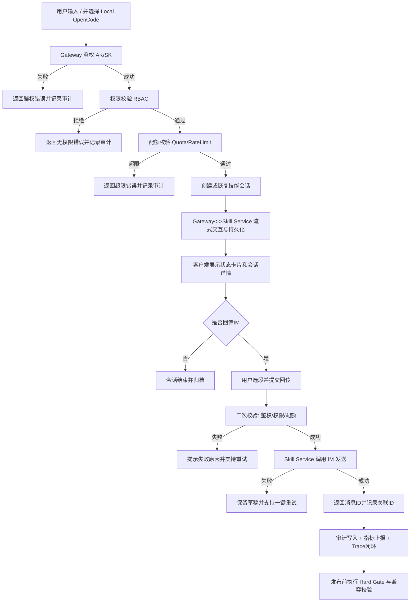

# OpenCode Skill Bridge 项目级需求规格说明书

## 1. 项目定义

- 项目名称：OpenCode Skill Bridge for Enterprise IM
- 核心目标：在企业 IM 场景中构建“可触发、可会话、可回传、可治理、可审计、可持续演进”的 AI 技能闭环能力。
- 适用范围：覆盖项目全生命周期需求（已交付 v1.0 + 后续里程碑规划），不是单一阶段文档。

## 2. 目标分层

### 2.1 L0 项目级业务目标

1. 让终端用户在 IM 内低门槛触发 AI 技能并进行多轮会话。
2. 让企业侧可控地治理谁可以使用、可以使用多少、发生了什么。
3. 让平台侧在版本演进中保持兼容、安全、稳定和可观测。

### 2.2 L1 已实现目标（v1.0）

1. 完成 Slash 触发、技能会话、回传 IM 的端到端闭环。
2. 完成网关鉴权、桥接协议、持久化、可观测与可靠性基线。
3. 完成插件-网关契约治理与硬门禁发布机制。

### 2.3 L2 待实现目标（后续里程碑）

1. 多端能力对齐（Android/iPhone/Harmony）。
2. 租户级 RBAC 与配额治理。
3. 审计看板与导出能力。
4. 生产级硬化与运营能力增强。

## 3. 核心业务主流程图（Mermaid）

## 4. 用户角色分析（参与者与核心痛点）

| 角色 | 类型 | 核心诉求 | 当前痛点 | 价值结果 |
|---|---|---|---|---|
| 终端用户 | C端 | 快速发起技能并得到稳定响应 | 多端体验不一致，失败提示不清晰 | 提升使用成功率与会话完成率 |
| 租户管理员 | B端 | 精细控制权限与使用额度 | 缺少统一策略管理与回滚能力 | 降低滥用风险，提升治理效率 |
| 运营/审计人员 | B端 | 查询行为、导出留档、定位异常 | 审计数据分散，导出流程不统一 | 降低审计成本，提升合规能力 |
| 运维/发布负责人 | 平台侧 | 上线可控、门禁可执行、风险可追踪 | 变更影响面不透明，豁免不可追责 | 降低发布事故率 |
| 开发/测试团队 | 交付侧 | 清晰规则与可测试边界 | 异常流程定义不全，跨模块协同复杂 | 提升交付质量与回归效率 |

## 5. 功能拆解（项目全量）

> 说明：下表按“已交付 + 规划中”统一给出，确保是全项目功能清单。

| 功能模块 | 子功能 | 详细逻辑描述 | 前置条件 | 异常流程处理 | 状态 |
|---|---|---|---|---|---|
| 触发入口 | Slash 触发技能 | 用户输入 `/` 后展示 `SKILL` 选择器，选择 `Local OpenCode` 并提交问题 | 客户端在线，入口开关开启 | 入口缺失时返回可操作错误码并提示检查版本/配置 | 已交付 |
| 触发入口 | 受理反馈 | 提交后返回受理状态并显示运行卡片 | Gateway 可达 | 超时返回受理超时并允许重试 | 已交付 |
| 会话管理 | 会话创建/复用 | 按会话键创建或复用技能会话，保持上下文连续 | 鉴权通过 | 冲突时返回冲突码与下一步建议 | 已交付 |
| 会话管理 | 增量流同步 | 增量事件同步到卡片和会话页，状态机统一 | 会话有效 | 乱序触发补偿，记录 anomaly | 已交付 |
| 会话管理 | 断线重连恢复 | 网络中断后自动恢复会话，保障无重复无倒序 | 支持重连协议 | 重连失败返回 `reason_code + next_action` | 已交付 |
| 回传能力 | 文本选段与预览 | 用户选择 AI 输出片段并预览确认后提交 | 存在可选片段 | 片段无效则阻止提交并提示 | 已交付 |
| 回传能力 | 回传 IM | 调用 IM API 发送消息，返回消息ID并关联源会话 | 具备回传权限且未超配额 | 失败保留草稿并支持一键重试 | 已交付 |
| 网关鉴权 | AK/SK 校验 | 连接建立前执行 AK/SK 验证并输出标准失败模型 | 客户端配置 AK/SK | 无效凭据直接拒绝并记录审计 | 已交付 |
| 协议桥接 | OpenCode 与内部协议转换 | 双向转换并保留必要扩展字段 | 契约映射有效 | 版本不匹配返回兼容错误 | 已交付 |
| 持久化 | 会话历史存储 | 存储 session/actor/seq/trace 等字段并支持分页查询 | Skill Service 可用 | 落库失败异步重试并标记状态 | 已交付 |
| 可靠性 | 幂等与重复抑制 | 回传使用幂等键，重复请求直接回放结果 | 幂等键可计算 | 幂等冲突记录审计并返回稳定结果 | 已交付 |
| 可观测 | 指标与日志 | 统一日志字段与低基数指标，贯穿插件/网关/服务 | 观测组件可用 | 写入失败告警，保留最小业务链路 | 已交付 |
| 契约治理 | contract_version 兼容策略 | 关键边界事件强制携带版本字段并执行兼容检查 | 契约映射完整 | 破坏性变更阻断发布 | 已交付 |
| 发布治理 | Hard Gate 门禁 | 发布前执行 no-drift/integration/real-chain/auth-resume 回归 | CI 环境可用 | 任一门禁失败禁止发布 | 已交付 |
| 发布治理 | 豁免机制 | 仅允许带 owner/approver/expiration 的临时豁免 | 审批链有效 | 过期或缺字段自动失效 | 已交付 |
| 多端扩展 | Android 客户端对齐 | 触发、会话、回传行为与现有端一致 | Android 客户端接入 SDK | 版本不支持时按能力降级并提示 | 规划中 |
| 多端扩展 | iPhone 客户端对齐 | iOS 侧实现同等触发与会话闭环 | iOS 客户端接入 SDK | 不兼容版本走只读或引导升级 | 规划中 |
| 多端扩展 | Harmony 客户端对齐 | Harmony 侧实现同等交互与回传 | Harmony 客户端接入 SDK | 不支持功能灰度关闭 | 规划中 |
| 治理中心 | 租户 RBAC | 基于租户+角色+能力点进行 allow/deny 决策 | 策略已发布 | 策略缺失默认拒绝并触发告警 | 规划中 |
| 治理中心 | 租户配额与限流 | 分钟/小时/日配额 + 突发限流 | 配额策略有效 | 超限返回错误码与重试时间 | 规划中 |
| 治理中心 | 策略版本发布与回滚 | 策略版本化、灰度生效、可回滚 | 管理员具备权限 | 发布失败自动回滚上个版本 | 规划中 |
| 审计运营 | 审计查询看板 | 按租户/用户/会话/时间/状态检索与聚合 | 审计数据可用 | 超时降级并记录慢查询 | 规划中 |
| 审计运营 | CSV 导出 | 提交异步导出任务并跟踪状态 | 具备导出权限 | 失败可重提并记录失败原因 | 规划中 |
| 运营保障 | 生产硬化 | 增强容量、SLO、告警与应急策略 | 监控和压测体系就绪 | 指标异常触发分级降级策略 | 规划中 |

## 6. 项目级需求清单（按需求ID归档）

### 6.1 v1 核心需求（已完成）

- CMD-01..03：命令触发链路。
- SKL-01..04：会话交互与回传选段。
- BRG-01..04：桥接与连接稳定性。
- AUT-01..03：鉴权与安全边界。
- SVC-01..04：持久化与回传服务。
- IMS-01..03：回传 IM 业务闭环。
- DEM-01..02：Demo 与可观测闭环。
- P01.1-*：插件架构纠偏与 no-drift 治理。
- P07-*：契约兼容、门禁与证据治理闭环。

### 6.2 后续需求（待完成）

- MCL-01..03：多端客户端能力对齐。
- PRD-01：角色权限控制。
- PRD-02：租户配额与限流。
- PRD-03：审计看板与运营能力。

## 7. 非功能性需求

### 7.1 性能指标

| 指标ID | 指标项 | 目标值 |
|---|---|---|
| NFR-PERF-01 | Slash 触发到受理回执时延 | P95 < 800ms，P99 < 1.2s |
| NFR-PERF-02 | 会话增量事件端到端延迟 | P95 < 1.0s |
| NFR-PERF-03 | 审计查询响应 | 常规查询 P95 < 1.5s |
| NFR-PERF-04 | 导出任务完成时长 | 10万行以内 <= 3分钟 |

### 7.2 安全性要求

| 指标ID | 要求 | 说明 |
|---|---|---|
| NFR-SEC-01 | 强鉴权 | 所有入口必须 AK/SK 鉴权 |
| NFR-SEC-02 | 最小权限 | RBAC 默认拒绝，显式授权放行 |
| NFR-SEC-03 | 敏感信息保护 | AK/SK、Token、PII 禁止明文日志 |
| NFR-SEC-04 | 审计完整性 | 策略变更、发布豁免、导出行为必须可追踪 |
| NFR-SEC-05 | 传输安全 | 客户端到网关、服务间通信必须使用安全通道 |

### 7.3 数据一致性要求

| 指标ID | 一致性要求 | 说明 |
|---|---|---|
| NFR-CONS-01 | 会话事件顺序一致 | 同会话内严格按序处理，异常触发补偿 |
| NFR-CONS-02 | 回传幂等一致 | 相同幂等键只能产生一次实际发送 |
| NFR-CONS-03 | 策略版本一致 | 所有网关节点最终收敛到同一策略版本 |
| NFR-CONS-04 | 审计记录一致 | 关键行为必须落审计并可关联 trace |

## 8. 项目验收口径（全项目）

1. 功能验收：已交付需求保持稳定，规划需求按阶段上线且无核心回归。
2. 质量验收：关键门禁命令与 CI 流程必须全绿。
3. 运维验收：关键指标、告警、排障链路可用。
4. 治理验收：权限、配额、审计、豁免机制可执行且可追责。

## 9. 依赖与约束

- 技术栈约束：JDK 21 + Spring Boot 3.4.6 + MyBatis + MySQL 5.7，TS 插件/前端模块。
- 兼容约束：不得破坏现有 IM 消息模型与接口契约。
- 安全约束：鉴权前置、最小权限、敏感字段脱敏。
- 组织约束：多端能力推进依赖客户端团队排期与联调窗口。

## 10. 风险与应对

| 风险 | 影响 | 应对策略 |
|---|---|---|
| 多端实现差异 | 体验不一致，回归成本上升 | 统一状态机与跨端兼容测试套件 |
| 策略误配置 | 误封/放量导致业务异常 | 灰度发布、回滚按钮、策略校验 |
| 审计数据增长 | 查询导出性能下降 | 分区索引、冷热分层、异步导出 |
| 豁免滥用 | 门禁失效 | 到期强制失效、审批审计闭环 |
| 依赖系统波动 | 回传失败率上升 | 幂等重试、降级与可观测告警 |

## 11. OpenSpec 合规声明

- 本文档为项目级需求规格，不局限某一阶段。
- 已包含：业务主流程图、角色痛点、功能拆解、非功能要求。
- 已包含：前置条件、异常处理、约束、风险、验收口径。
