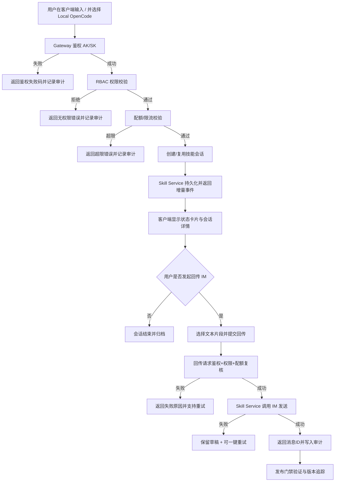

# 需求规格说明书（优化版）

## 1. 项目概述

- 项目名称：`OpenCode Skill Bridge for Enterprise IM`
- 核心目标：将 IM 中的 AI 技能会话从“可用”提升为“可治理、可审计、可多端复用”的标准能力。
- 文档目标：将当前模糊的产品设想，收敛为可实现、可测试、可追踪的业务规则与功能清单。

## 2. 业务目标与范围

### 2.1 业务目标

1. 打通 Android/iPhone/Harmony 与现有 Web/PC 的技能触发、会话、回传一致体验。
2. 建立租户级权限（RBAC）与配额（Quota）治理体系，防止能力滥用。
3. 建立审计查询与导出能力，满足运营追踪与合规留痕。
4. 固化契约兼容与发布门禁，确保版本演进不破坏现网稳定性。

### 2.2 In Scope

- 多端能力对齐（触发、会话、回传）。
- 租户治理（权限、配额、配置中心）。
- 审计能力（查询、导出、留痕）。
- 兼容治理（`contract_version`）与发布门禁（含豁免策略）。

### 2.3 Out of Scope

- 多 Agent 编排与工具市场。
- 跨地域双活架构升级。
- 商业化计费系统。

## 3. 核心业务主流程（Mermaid）

## 4. 用户角色分析

| 角色 | 核心职责 | 当前痛点 | 核心诉求 |
|---|---|---|---|
| 终端用户（C 端） | 发起技能、多轮会话、回传IM | 多端体验不一致，失败原因不透明 | 交互一致、失败可理解、重试成本低 |
| 租户管理员（B 端） | 管理权限和配额策略 | 无法精细控制谁能用、能用多少 | 可配置、可回滚、变更可追踪 |
| 运营/审计人员（B 端） | 追踪调用、分析问题、导出留档 | 缺少统一查询入口与导出能力 | 查询高效、过滤准确、导出可审计 |
| 平台运维/发布负责人 | 保障上线稳定与合规 | 变更影响面难量化、门禁不可追踪 | 发布可阻断、豁免可追责、兼容可验证 |
| 开发/测试团队 | 功能交付与质量保障 | 需求边界不清，异常流程遗漏 | 明确规则、完整异常、可自动化验证 |

## 5. 功能拆解（含逻辑、前置、异常）

| 功能模块 | 子功能 | 详细逻辑描述 | 前置条件 | 异常流程处理 |
|---|---|---|---|---|
| 多端触发中心 | Slash 触发入口 | 用户输入 `/` 展示技能选择器并选择 `Local OpenCode`，提交后创建请求上下文 | 客户端在线，技能入口已启用 | 入口不可用：返回标准错误码并提示检查客户端版本/租户配置 |
| 多端触发中心 | 请求受理反馈 | 提交后 800ms 内返回受理状态（pending）并显示会话卡片 | Gateway 可达 | 超时：返回“受理超时”并支持重试；记录 `trace_id` |
| 会话运行时 | 会话创建/复用 | 根据会话键创建或复用会话，确保同一会话上下文连续 | 鉴权、权限、配额均通过 | 会话冲突：返回冲突码并给出下一步动作 |
| 会话运行时 | 增量消息同步 | 将增量事件推送到卡片与会话详情，状态机统一 `pending->in_progress->completed/failed` | 会话有效 | 序列异常：触发补偿策略并记录 anomaly 事件 |
| 会话运行时 | 断线重连恢复 | 断线后按重连策略恢复，保证无重复、无倒序 | 客户端支持重连协议 | 重连失败：返回 `reason_code + next_action` 并引导人工重试 |
| 回传中心 | 文本片段选择与预览 | 用户选择单段文本，进入预览确认页，支持轻量编辑 | 会话中存在可回传文本 | 片段无效：阻止提交并提示重新选择 |
| 回传中心 | 回传提交与状态反馈 | 提交后由 Skill Service 调用 IM 发送，返回消息ID与关联ID | 用户具备回传权限，配额未超限 | 发送失败：保留草稿，支持一键重试，返回可操作错误码 |
| 权限治理 | RBAC 策略判断 | 按租户+角色+能力点（trigger/session/sendback）做 allow/deny 决策 | 策略已发布且版本有效 | 策略缺失：按默认拒绝并记录配置缺失审计 |
| 配额治理 | 限流与配额校验 | 按分钟/小时/日窗口核验额度，并做突发限流 | 配额策略已配置 | 超限：返回配额错误码 + 建议重试时间 |
| 配置中心 | 策略版本发布 | 权限/配额策略版本化发布，支持灰度与校验和校验 | 管理员具备发布权限 | 发布失败：自动回滚到上个稳定版本 |
| 配置中心 | 策略回滚 | 发现问题可在 5 分钟内回滚到上一版本 | 存在可回滚版本 | 回滚失败：触发告警并启用兜底策略 |
| 审计中心 | 审计事件写入 | 关键行为写入审计事件（触发、拒绝、超限、回传、导出） | 事件通道可用 | 写入失败：异步重试，达到上限后告警 |
| 审计中心 | 审计查询 | 按租户/用户/会话/时间/结果查询，支持分页排序 | 查询权限通过 | 查询超时：返回分页降级提示并记录慢查询 |
| 审计中心 | CSV 导出 | 运营提交导出任务，异步生成文件并可追踪状态 | 导出权限通过 | 导出失败：记录失败原因并支持重新提交 |
| 契约治理 | contract_version 校验 | 插件与网关关键事件必须带 `contract_version` 并通过兼容检查 | 契约映射配置完整 | 字段缺失或不兼容：阻断流程并输出兼容错误 |
| 发布治理 | Hard Gate 校验 | 发布前执行全量门禁校验（no-drift/integration/real-chain/auth-resume） | CI 环境可用 | 任一门禁失败：禁止发布；仅可通过豁免流程处理 |
| 发布治理 | 豁免闭环 | 豁免必须包含 owner/approver/expiration，过期自动失效 | 审批链完整 | 豁免过期或字段不完整：自动阻断发布 |

## 6. 业务规则（逻辑无死角）

1. 所有技能触发请求必须先鉴权，再做权限与配额校验，禁止绕过。
2. 权限缺失与配额超限必须返回不同错误码，便于用户与运营定位问题。
3. 会话状态只能单向流转，不允许从终态回退到运行态。
4. 回传 IM 必须具备幂等语义，避免重复发送。
5. 所有关键事件必须包含 `trace_id`、`session_id`、`tenant_id`、`contract_version`（适用边界事件）。
6. 策略变更必须版本化，并保留操作审计记录。
7. 任一发布门禁失败即阻断发布；豁免仅在审批通过且未过期时生效。

## 7. 非功能性需求

### 7.1 性能指标

| 指标ID | 指标项 | 目标值 |
|---|---|---|
| NFR-001 | Slash 触发受理时延 | P95 < 800ms，P99 < 1.2s |
| NFR-002 | 审计查询响应 | 常规查询 P95 < 1.5s |
| NFR-003 | CSV 导出完成时长 | 10万行以内 <= 3分钟 |
| NFR-004 | 策略发布生效时延 | <= 60s（全节点） |

### 7.2 安全性要求

| 指标ID | 要求 | 说明 |
|---|---|---|
| SEC-001 | 强鉴权 | 所有入口必须通过 AK/SK 鉴权 |
| SEC-002 | 最小权限 | RBAC 默认拒绝，显式授权放行 |
| SEC-003 | 敏感信息保护 | 日志禁止明文输出 AK/SK、token、PII |
| SEC-004 | 操作可审计 | 策略发布、回滚、豁免均需审计记录 |
| SEC-005 | 导出权限控制 | 导出能力按角色授权，下载链接受时效控制 |

### 7.3 数据一致性要求

| 指标ID | 一致性要求 | 说明 |
|---|---|---|
| CONS-001 | 会话事件顺序一致 | 同会话事件必须按序处理，检测乱序并补偿 |
| CONS-002 | 回传幂等一致 | 相同幂等键重复提交仅产生一次 IM 发送 |
| CONS-003 | 策略版本一致 | 网关节点策略版本最终一致，校验和一致 |
| CONS-004 | 审计记录完整 | 关键动作必须写入审计事件，失败可追踪 |

## 8. 验收标准（DoD）

1. 功能维度：`FR-001..FR-010` 全部通过测试并完成可追踪证据。
2. 非功能维度：性能、安全、一致性指标满足阈值。
3. 治理维度：`contract_version` 兼容策略、Hard Gate、豁免流程全部可执行。
4. 运维维度：异常流程均有标准错误码、日志字段与告警策略。

## 9. 需求追踪矩阵

| 需求ID | 架构章节 | 方案章节 | 测试用例 |
|---|---|---|---|
| FR-001 | ARC-4.2 | SOL-5.1 | TC-001, TC-002 |
| FR-002 | ARC-5.1 | SOL-5.1 | TC-003, TC-004 |
| FR-003 | ARC-5.2 | SOL-5.1 | TC-005, TC-006 |
| FR-004 | ARC-4.3 | SOL-5.2 | TC-007, TC-008, TC-009 |
| FR-005 | ARC-4.3 | SOL-5.2 | TC-010, TC-011, TC-012 |
| FR-006 | ARC-4.4 | SOL-5.3 | TC-013, TC-014 |
| FR-007 | ARC-4.4 | SOL-5.3 | TC-015 |
| FR-008 | ARC-4.5 | SOL-5.4 | TC-016, TC-017 |
| FR-009 | ARC-6.1 | SOL-5.5 | TC-018, TC-019 |
| FR-010 | ARC-6.2 | SOL-5.5 | TC-020 |
| NFR-001..004 | ARC-7 | SOL-6 | TC-021..TC-024 |
| SEC-001..005 | ARC-7.3 | SOL-6.3 | TC-023 |
| CONS-001..004 | ARC-5/ARC-8 | SOL-5.1/SOL-5.3 | TC-024..TC-026 |

## 10. OpenSpec 合规声明

- 已提供：业务主流程图（Mermaid）、角色分析、功能拆解（含前置与异常）、非功能指标。
- 已提供：验收标准与跨文档追踪矩阵，支持研发、测试、上线全过程审查。
