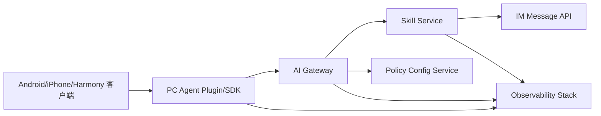

# ARC-1. 文档目的

定义 `v1.1` 的目标架构，确保能够满足 `OSR-CHATCUI-V1.1` 中的 FR/NFR，并与既有 `v1.0` 实现兼容演进。

# ARC-2. 架构原则

- 向后兼容优先：边界契约遵循增量演进，不引入破坏性变更。
- 治理前置：权限、配额、审计在网关入口统一治理。
- 端到端可观测：所有关键链路具备统一追踪字段与低基数指标。
- 配置可回滚：策略更新支持版本化与快速回退。

# ARC-3. 系统上下文

说明：

- 客户端通过插件/SDK 触发技能请求。
- Gateway 负责鉴权、权限、配额、协议转换与路由。
- Skill Service 负责会话持久化、历史查询、回传 IM。
- Policy Config Service 负责租户治理策略分发。
- Observability Stack 提供日志、指标、链路追踪。

# ARC-4. 容器与模块设计

## ARC-4.1 Client SDK/Plugin 层

- 统一 Slash 触发、会话状态同步、回传交互。
- 边界事件强制带 `contract_version`。
- 关键模块：
  - `TriggerAdapter`
  - `SessionRuntime`
  - `SendbackAdapter`
  - `ContractGuard`

## ARC-4.2 Gateway 接入层（对应 FR-001/FR-002/FR-003）

- 责任：
  - 鉴权（AK/SK）
  - 连接会话管理
  - 协议桥接
  - 错误码标准化
- 新增能力：
  - 跨端能力标识识别（android/ios/harmony/web/pc）
  - 客户端版本路由与兼容提示

## ARC-4.3 Gateway 治理层（对应 FR-004/FR-005）

- 模块：
  - `AuthzPolicyEngine`：RBAC 决策
  - `QuotaGuard`：配额核验与限流
  - `GovernanceInterceptor`：统一拦截
- 决策顺序：
  - 鉴权成功 -> 权限校验 -> 配额校验 -> 请求放行

## ARC-4.4 审计与运营层（对应 FR-006/FR-007）

- 模块：
  - `AuditEventWriter`：写入审计事件
  - `AuditQueryAPI`：查询接口
  - `AuditExportWorker`：导出任务处理
- 设计要点：
  - 写入异步化，避免主链路阻塞
  - 查询与导出按租户隔离

## ARC-4.5 配置治理层（对应 FR-008）

- 模块：
  - `PolicyConfigAPI`
  - `PolicyVersionStore`
  - `PolicyDistributionWorker`
- 设计要点：
  - 配置版本化（version + checksum）
  - 网关本地缓存 + 订阅刷新
  - 支持按租户灰度生效

# ARC-5. 关键时序

## ARC-5.1 技能触发与会话

1. 客户端发起 Slash 触发请求。
2. Gateway 鉴权成功后执行 RBAC 与配额检查。
3. Gateway 建立/复用会话并转发 Skill 请求。
4. Skill Service 返回增量事件并持久化。
5. 客户端显示状态卡片与会话详情，断线时按策略重连。

## ARC-5.2 回传 IM

1. 客户端提交选段回传请求。
2. Gateway 执行权限与配额校验。
3. Skill Service 写入回传请求与幂等键。
4. Skill Service 调用 IM API 发送消息。
5. 返回结果并记录审计事件。

# ARC-6. 契约与发布治理

## ARC-6.1 契约兼容治理（对应 FR-009）

- 关键事件必须包含：
  - `contract_version`
  - `session_id`
  - `trace_id`
  - `timestamp`
- 变更规则：
  - 允许新增字段（可选）
  - 禁止删除或变更既有字段语义
  - 废弃字段采用两版本过渡

## ARC-6.2 门禁与豁免（对应 FR-010）

- 发布门禁命令：
  - `npm.cmd --prefix pc-agent-plugin run verify:phase-07`
- 豁免字段要求：
  - `waiver_id`
  - `owner`
  - `approver`
  - `expiration_utc`
  - `justification`

# ARC-7. 非功能架构设计

## ARC-7.1 性能（NFR-001）

- 网关策略判断采用内存缓存，配置变更异步刷新。
- 导出任务走异步队列，避免查询接口阻塞。

## ARC-7.2 可用性（NFR-002）

- Gateway/Skill Service 水平扩展。
- 重连恢复采用幂等语义，防止重复发送。

## ARC-7.3 安全（NFR-003）

- 敏感字段日志脱敏（AK/SK、token、个人信息）。
- 权限策略最小化，拒绝默认优先。

## ARC-7.4 可观测（NFR-004）

- 统一结构化日志字段：
  - `trace_id`
  - `tenant_id`
  - `session_id`
  - `failure_class`
  - `outcome`
- 指标命名延续现有低基数设计规范。

## ARC-7.5 兼容性（NFR-005）

- 合同检查纳入 CI，版本信号纳入回归测试。
- 边界事件通过契约测试保障兼容。

# ARC-8. 数据模型扩展

## ARC-8.1 权限策略表（示意）

| 字段 | 类型 | 说明 |
|---|---|---|
| tenant_id | varchar | 租户标识 |
| role_id | varchar | 角色标识 |
| capability | varchar | 能力点（trigger/session/sendback） |
| effect | varchar | allow/deny |
| policy_version | bigint | 策略版本 |
| updated_at | datetime | 更新时间 |

## ARC-8.2 配额策略表（示意）

| 字段 | 类型 | 说明 |
|---|---|---|
| tenant_id | varchar | 租户标识 |
| quota_window | varchar | minute/hour/day |
| quota_limit | int | 窗口配额上限 |
| burst_limit | int | 瞬时限流阈值 |
| policy_version | bigint | 策略版本 |

## ARC-8.3 审计事件表（示意）

| 字段 | 类型 | 说明 |
|---|---|---|
| event_id | varchar | 事件ID |
| tenant_id | varchar | 租户标识 |
| actor_id | varchar | 操作人 |
| action | varchar | trigger/session/sendback/config |
| result | varchar | success/failure |
| trace_id | varchar | 链路追踪ID |
| created_at | datetime | 发生时间 |

# ARC-9. OpenSpec 合规检查

- 明确架构原则、上下文、容器、时序、数据模型。
- FR/NFR 均有架构映射与约束说明。
- 契约兼容与发布治理规则可执行、可审计。
