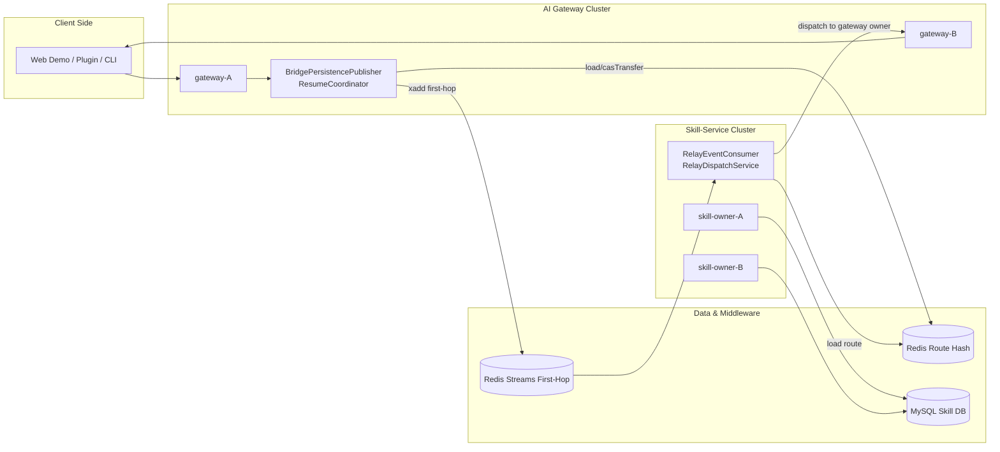

# ARC-1. 架构目标

在 `ai-gateway` 与 `skill-service` 多实例部署下，构建“可迁移 owner、可跨实例转发、可有界恢复、可观测可诊断”的消息投递架构，满足 `P08-ROUTE-01` 到 `P08-OBS-01`。

# ARC-2. 技术栈选型

| 层级 | 技术选型 | 理由 |
|---|---|---|
| 语言 | Java 21 | 与现有 gateway/skill-service 代码一致，支持 record 与现代并发模型 |
| 核心框架 | Spring Boot 3.4.x（skill-service） | 便于 API 暴露、依赖注入、测试集成 |
| 持久化 | MyBatis + MySQL 5.7+（业务快照/回传） | 结构化查询稳定，兼容既有模型 |
| 路由状态 | Redis Hash（route table） | 低延迟、支持 Lua CAS 原子迁移 |
| 跨实例中间件 | Redis Streams + Consumer Group | 支持 at-least-once、pending 管理与恢复 |
| 指标体系 | Micrometer | 统一低基数指标模型，便于接入 Prometheus |

# ARC-3. 逻辑架构图（Mermaid）



# ARC-4. 核心组件协作设计

## ARC-4.1 路由真相源（RouteOwnershipStore）

- 键模型：`chatcui:route:{tenant_id:session_id}`
- 关键字段：`route_version`、`skill_owner`、`gateway_owner`、`fenced_owner`、`updated_at_epoch_ms`
- 迁移规则：仅允许 `casTransfer(expected_route_version, new_skill_owner, new_gateway_owner, fenced_owner)` 原子执行
- 冲突语义：
1. `APPLIED`：迁移成功且版本自增
2. `VERSION_CONFLICT`：当前版本不等于期望版本
3. `MISSING`：路由不存在

## ARC-4.2 Fencing 与 owner 冲突收敛

- stale owner 在 resume 或投递阶段命中 fencing 必须返回 `OWNER_FENCED`
- `OWNER_FENCED` 归类为终态分支，`next_action=reroute_to_active_owner`
- 该分支要求输出 `route_version` 便于上游重路由

## ARC-4.3 跨实例 relay 链路

- 首跳发布：非目标 gateway owner 生成 `RelayEnvelope` 写入 stream
- stream key：`chatcui:relay:first-hop:{tenant:session}`
- 首跳字段包含 `source_gateway_owner`、`target_skill_owner`、`target_gateway_owner`、`route_version`
- 消费模型：skill owner 使用 consumer group 消费并派发到目标 gateway owner

## ARC-4.4 去重与幂等

- 去重元组固定：`session_id|turn_id|seq|topic`
- 发布侧：Redis `SET NX + EX(15m)` 防止重复首跳
- 消费侧：`TupleDedupeStore.markIfAbsent`；重复消息立即 ACK 并计数 `duplicate_dropped`

## ARC-4.5 ACK 与恢复

- ACK 两阶段：
1. `gateway_owner_accepted`
2. `client_delivered` 或 `client_delivery_timeout`
- `UnknownOwnerRecoveryWorker` 对 route 缺失场景提供 15 分钟有界重查，过窗返回 `ROUTE_REPLAY_WINDOW_EXPIRED`

# ARC-5. 关键技术挑战处理

## ARC-5.1 高并发 owner 迁移竞争

- 采用 Lua CAS，一次脚本内完成“版本校验 + 字段更新 + TTL 设置”
- 不允许“先读后写”跨请求拼接，避免并发覆盖

## ARC-5.2 多实例下精确投递

- 通过 route 中的 owner pair（`skill_owner + gateway_owner`）唯一确定投递路径
- 非 owner gateway 不执行本地下发，必须 relay 到 skill owner

## ARC-5.3 恢复与重试风暴控制

- route 缺失不立刻失败，但重试窗口严格限制 15 分钟
- 过窗后强制终态，避免无限积压

## ARC-5.4 实时可观测

- 指标标签只允许低基数字段：`component/failure_class/outcome/retryable`
- `trace_id/session_id/turn_id/route_version` 写日志不写指标标签

# ARC-6. 接口定义规范

## ARC-6.1 API 风格

- 外部业务 API：RESTful（skill-service 对 demo 提供 HTTP）
- 内部链路事件：结构化事件体（relay envelope / dispatch event）
- 预留演进：跨服务强约束接口可升级 gRPC，但 Phase 8 保持现有风格

## ARC-6.2 公共返回体约定

成功响应示例：

```json
{
  "request_id": "req-20260304-001",
  "status": "accepted",
  "trace_id": "trace-a"
}
```

失败响应示例：

```json
{
  "error": {
    "code": "OWNER_FENCED",
    "message": "stale owner rejected",
    "next_action": "reroute_to_active_owner",
    "trace_id": "trace-a",
    "route_version": 42
  }
}
```

## ARC-6.3 关键字段规范

| 字段 | 说明 | 约束 |
|---|---|---|
| `tenant_id` | 租户标识 | 必填，非空字符串 |
| `session_id` | 会话标识 | 必填，非空字符串 |
| `turn_id` | 轮次标识 | 必填，非空字符串 |
| `seq` | 会话内递增序号 | 必填，`>=0` |
| `trace_id` | 链路追踪 ID | 必填，跨服务透传 |
| `route_version` | 路由版本 | 必填，`>=0` |

# ARC-7. 扩展性设计

1. 路由层可替换：`RouteOwnershipStore` 已抽象，支持 Redis 之外实现。
2. relay 层可替换：`RelayPublisher` 与 `RelayEventConsumer` 解耦，可迁移到 Kafka/NATS。
3. 指标层可替换：`BridgeMetricsRegistry` 与 `SkillMetricsRecorder` 只依赖 Micrometer 抽象。
4. 恢复策略可配置：回放窗口可按部署环境覆盖。

# ARC-8. 与需求映射

| 架构点 | 对应需求ID |
|---|---|
| Redis 路由真相源 + CAS | `P08-ROUTE-01` |
| fenced owner 终态拒绝 | `P08-FENCE-01` |
| 首跳 relay + owner 消费 | `P08-RELAY-01` |
| 去重 tuple 双端执行 | `P08-DEDUPE-01` |
| 两阶段 ACK 状态机 | `P08-ACK-01` |
| 15 分钟有界恢复 | `P08-RECOVERY-01` |
| 指标 + 结构化日志基线 | `P08-OBS-01` |

