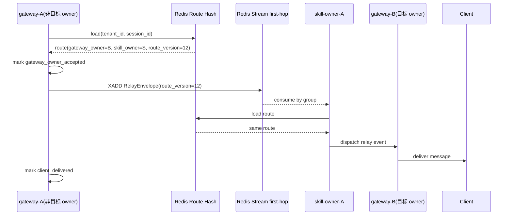
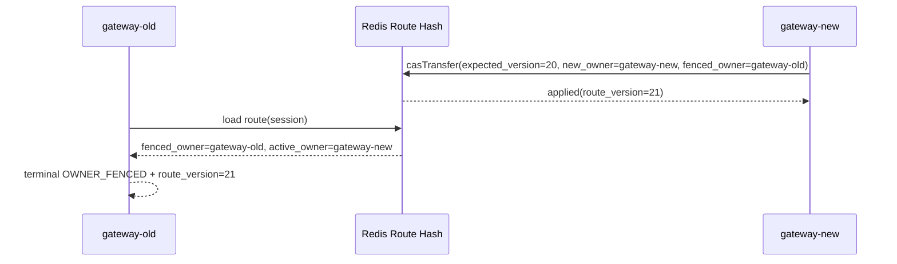
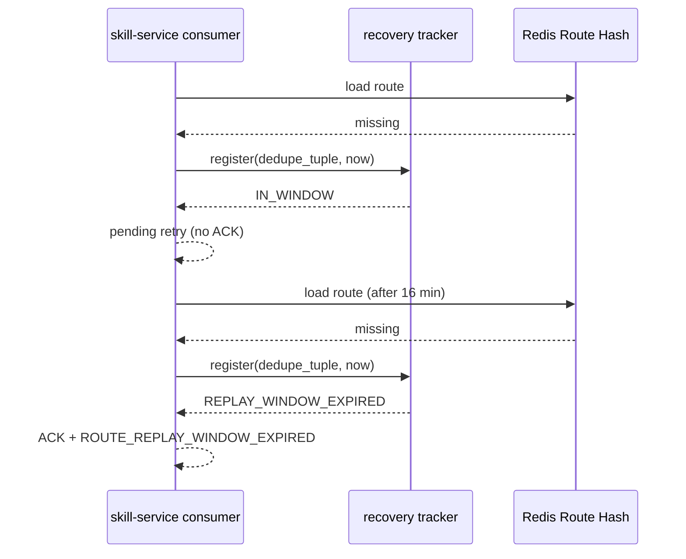

# Phase 8 详细方案设计文档（LLD）

文档版本：`1.0.0`  
适用阶段：`08-ai-gateway-skill-service-opencode`  
更新时间：`2026-03-04`

## 1. 设计目标

解决以下核心技术问题：

1. gateway 与 skill-service 多实例下，消息如何精准送达目标客户端。
2. owner 迁移时，如何确保旧 owner 不继续写入。
3. 跨实例 relay 如何在 at-least-once 下实现幂等。
4. 异常恢复如何有界并可解释。

对应需求：`P08-ROUTE-01`、`P08-FENCE-01`、`P08-RELAY-01`、`P08-DEDUPE-01`、`P08-ACK-01`、`P08-RECOVERY-01`、`P08-OBS-01`。

## 2. 模块边界与职责

| 模块 | 主要类 | 职责 |
|---|---|---|
| 路由归属 | `RouteOwnershipRecord` `RedisRouteOwnershipStore` | 管理会话 owner pair 与版本迁移 |
| 首跳发布 | `RelayEnvelope` `RedisRelayPublisher` | 非目标 gateway 的首跳 relay 发布 |
| 统一发布协调 | `BridgePersistencePublisher` | 在本地 forward 与 relay 间做决策并产出 ACK |
| ACK 状态机 | `DeliveryAckStateMachine` | 维护 `accepted/delivered/timeout` 单向状态 |
| 恢复器 | `UnknownOwnerRecoveryWorker` | route 缺失场景下的有界重试与终态失败 |
| 消费分发 | `RelayEventConsumer` `RelayDispatchService` | skill owner 消费首跳消息并二跳分发 |
| 可观测 | `BridgeMetricsRegistry` `SkillMetricsRecorder` | 指标记录与日志关联字段 |

## 3. 数据模型设计

## 3.1 Redis 数据模型

### 3.1.1 Route Hash

- Key：`chatcui:route:{tenant_id:session_id}`
- Type：`HASH`

| 字段 | 类型 | 必填 | 说明 |
|---|---|---|---|
| `tenant_id` | string | 是 | 租户 ID |
| `session_id` | string | 是 | 会话 ID |
| `route_version` | long | 是 | 版本号，CAS 成功后自增 |
| `skill_owner` | string | 是 | 当前 skill-service owner |
| `gateway_owner` | string | 是 | 当前 gateway owner |
| `fenced_owner` | string | 否 | 被 fence 的旧 gateway owner |
| `updated_at_epoch_ms` | long | 是 | 更新时间戳 |

### 3.1.2 First-Hop Stream

- Key：`chatcui:relay:first-hop:{tenant:session}`
- Type：`STREAM`
- Consumer Group：由部署指定，例如 `relay-first-hop`

消息字段（核心）：

| 字段 | 类型 | 说明 |
|---|---|---|
| `tenant_id/client_id/session_id/turn_id/seq/topic/trace_id` | string/long | 基础业务标识 |
| `route_version` | long | 当次路由版本 |
| `source_gateway_owner` | string | 首跳来源 gateway |
| `target_skill_owner` | string | 目标 skill owner |
| `target_gateway_owner` | string | 二跳目标 gateway owner |
| `dedupe_key` | string | 去重键 |
| `reason_code/next_action` | string | 失败语义扩展字段 |
| `envelope_json` | string | 完整序列化副本 |

### 3.1.3 Dedupe Key

- Key：`chatcui:relay:dedupe:{tenant:session}||{dedupe_tuple}`
- Value：`trace_id`
- 写入策略：`SET key value NX EX 900`
- dedupe tuple：`session_id|turn_id|seq|topic`

## 3.2 MySQL 数据模型（与 phase8 交互相关）

本阶段不新增 MySQL 表结构，但依赖已有业务表承接会话与回传落库。建表 DDL 参考：

- `skill-service/src/main/resources/db/migration/V1__skill_turn_tables.sql`
- `skill-service/src/main/resources/db/migration/V2__skill_sendback_record.sql`
- `skill-service/src/main/resources/db/migration/V3__sendback_idempotency_guard.sql`

## 4. 关键类与结构体定义

## 4.1 RouteOwnershipRecord

```java
record RouteOwnershipRecord(
    String tenantId,
    String sessionId,
    long routeVersion,
    String skillOwner,
    String gatewayOwner,
    String fencedOwner,
    Instant updatedAt
)
```

约束：

1. `tenantId/sessionId/skillOwner/gatewayOwner` 非空。
2. `routeVersion >= 0`。
3. `fencedOwner` 可空但空白归一化为 null。

## 4.2 RelayEnvelope / RelayEvent

核心字段：

- 业务：`tenantId/clientId/sessionId/turnId/seq/topic/traceId`
- 路由：`routeVersion/sourceGatewayOwner/targetSkillOwner/targetGatewayOwner`
- 链路：`hop/partitionKey/dedupeKey`
- 语义：`actor/eventType/payload/reasonCode/nextAction`

## 4.3 AckSnapshot

```java
record AckSnapshot(
    Stage stage,
    String stageValue,
    String errorCode,
    String nextAction,
    String traceId,
    long routeVersion,
    String deliveryTuple
)
```

`Stage` 取值：

- `gateway_owner_accepted`
- `client_delivered`
- `client_delivery_timeout`

## 4.4 RecoveryEntry / RecoveryResult

`RecoveryEntry` 字段：

- `tenantId/sessionId/turnId/seq/topic/traceId/firstSeenAt/routeVersionHint`

`RecoveryResult` 字段：

- `status/errorCode/nextAction/traceId/routeVersion`

`status` 取值：

- `RETRIED`
- `PENDING_ROUTE_RECHECK`
- `REPLAY_WINDOW_EXPIRED`

## 5. 核心时序图

## 5.1 正常跨实例投递



## 5.2 owner fenced 分支



## 5.3 未知 owner 恢复与过窗终态



## 6. 关键算法设计

## 6.1 CAS 路由迁移（Lua）

伪代码：

```text
if route not exists:
  return missing
if current_version != expected_version:
  return conflict(current_snapshot)
next_version = current_version + 1
HSET route fields with new owners + fenced_owner + updated_at
EXPIRE route ttl
return applied(next_snapshot)
```

关键点：

1. 校验与更新必须同脚本原子执行。
2. 冲突返回完整当前快照，便于调用方二次决策。

## 6.2 Gateway 发布决策算法（BridgePersistencePublisher）

伪代码：

```text
decision = resumeCoordinator.evaluate(...)
mark ack stage gateway_owner_accepted
if local owner is fenced:
  mark timeout(OWNER_FENCED, reroute_to_active_owner)
  return
if event is terminal error topic:
  local forward
  mark timeout(event.reason_code, event.next_action)
  return
if route exists and route.gateway_owner != local_gateway_owner:
  publish first-hop relay
  mark delivered
  return
local forward
mark delivered
```

## 6.3 Consume + Recovery 算法（RelayEventConsumer）

伪代码：

```text
if dedupe exists:
  ack
  return DUPLICATE_DROPPED

dispatch = relayDispatchService.dispatch(event, local_skill_owner)
if dispatch == PENDING_RETRY:
  release dedupe
  if reason == route_missing:
    if tracker.register(tuple, now) == REPLAY_WINDOW_EXPIRED:
      ack
      clear tracker
      return REPLAY_WINDOW_EXPIRED
  return PENDING_RETRY

ack
clear tracker
if dispatch == SKIPPED_NOT_OWNER:
  return SKIPPED_NOT_OWNER
return DISPATCHED
```

## 7. 缓存、重试与性能参数

| 参数 | 默认值 | 说明 |
|---|---|---|
| relay dedupe TTL | 15 分钟 | 防重复首跳发布 |
| unknown owner replay window | 15 分钟 | 恢复时间上界 |
| route TTL | 由业务配置 | 控制会话路由生命周期 |

优化建议：

1. route key 与 stream key 使用 hash tag，确保同会话 Redis slot 聚合。
2. `envelope_json` 保留可选开关，极限性能场景可关闭。
3. 高并发租户可按租户维度拆分 consumer group。

## 8. 可观测与排障设计

## 8.1 指标（低基数）

gateway 关键指标：

- `chatcui.gateway.route.outcomes`
- `chatcui.gateway.relay.outcomes`
- `chatcui.gateway.ack.outcomes`

skill-service 关键指标：

- `chatcui.skill.relay.outcomes`

统一标签：

- `component`
- `failure_class`
- `outcome`
- `retryable`

## 8.2 日志字段规范

必须输出：

- `stage`
- `trace_id`
- `route_version`
- `session_id`
- `turn_id`
- `seq`
- `topic`
- 可选 `reason_code`
- 可选 `next_action`

禁止输出：

- 用户消息正文
- 凭证类敏感字段

## 9. 异常矩阵

| 场景 | 检测点 | 返回语义 | 下一步动作 |
|---|---|---|---|
| route CAS 冲突 | `VERSION_CONFLICT` | 不覆盖当前 owner | 读取新版本后重试 |
| stale owner 收到消息 | `fenced_owner == local_owner` | `OWNER_FENCED` | `reroute_to_active_owner` |
| relay 发布异常 | publisher 抛错 | `RELAY_CLIENT_DELIVERY_TIMEOUT` | `retry_via_route_recheck` |
| route 缺失短时抖动 | recovery in-window | `PENDING_ROUTE_RECHECK` | 继续重查 |
| route 缺失超过窗口 | replay expired | `ROUTE_REPLAY_WINDOW_EXPIRED` | `restart_session` |

## 10. 验证基线

推荐最小验证命令：

1. `.\mvnw.cmd -pl gateway "-Dtest=RouteKeyFactoryTest,RedisRouteOwnershipStoreTest" test`
2. `.\mvnw.cmd -pl "gateway,skill-service" "-Dtest=BridgePersistencePublisherTest,CrossInstanceRelayIntegrationTest" test`
3. `.\mvnw.cmd -pl "gateway,skill-service" "-Dtest=DeliveryAckStateMachineTest,DeliveryRetryQueueTest,ResumeCoordinatorTest" "-Dsurefire.failIfNoSpecifiedTests=false" test`

验收参考：

- `.planning/phases/08-ai-gateway-skill-service-opencode/08-VERIFICATION.md`
- `.planning/phases/08-ai-gateway-skill-service-opencode/08-OBSERVABILITY-BASELINE.md`
- `.planning/phases/08-ai-gateway-skill-service-opencode/08-ACCEPTANCE-EVIDENCE.md`

